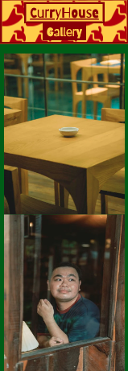

# CurryHouse Concept Restaurant 

The CurryHouse website was developed for a concept restaurant that serves different style curries from around the world in a fun, Asian-influenced hygge-style environment, offering branded merchandise and constantly changing menus in order to attract new as well as retain returning customers. This site will be targeted towards customers that value curry-related culture and their stylistic influences, especially from India and Southeast Asia, even if the menu choices are not limited to those areas. These are customers who are looking for an authentic dining experience but do not want to limit themselves to one country's food. CurryHouse hopes to attract dedicated customers to attain a large social media presence through merchandising and recognizable branding. Constantly changing available menu items to retain exclusivity and excitement for returning customers, as well as an incentive for new customers. 

## Features 

This section will include the features of this CurryHouse project and how they effectively aided in achieving all goals. 

### Navigation Bar

As seen above the navigation bar of the CurryHouse website implements an icon for the mobile and tablet device revealing all of its pages, for desktop it shows all of its options without having a dropdown list, except for the menu page which leads you to the different sections of the menu. 

On the left side of each navigation bar presented above you see our CurryHouse logo with its famous and recognizable chili attached at the end of the brand name, reminding our customers what we stand for, who we are, and what we offer. 

The dropdown menu for the "Menu" page specifically presents a fun and interactive way to tell our customers what we offer, including a section titled "Shareables" indicating that our dining experience is an immersive one. 

We have also added a visible "Merch" page to our navigation bar for easy access to ensure our customers have the opportunity to support us outside of dining with us. Adding this page to the navigation bar enables us to intrigue new customers because it is uncommon for non-chain restaurants to have branded merchandise available for purchase. 

#### Dropdown Menu

The navigation bar dropdown menu, and sub-dropdown menu of the "Menu" page has its text fall on the right side of the page enabling easy interaction on tablet and mobile devices. This is because most individuals are right-handed this was a conscious choice in the website design, ensuring customer satisfaction. 

### Landing Page 

As you can clearly see in the pictures above, it was important to double-down on the branding in the header of the landing page and restate "CurryHouse" supported by its chili logo repeatedly in the background to very aggressively imprint its branding into the customers memory. 

Calling it "Home of the Curry" supports the idea of it being the one-stop-shop for all dining experiences curry related, and reinforcing the message that in fact CurryHouse wants to feel like the home away from home for curry lovers. 

In the opening design one sees the representative, colors, fonts, and schemes that are supposed to strengthen all of the goals. A fun font, an immersive and culturally accurate color scheme, as well as Southeast Asian style golden laces on each side of the website for desktop and tablet users to emphasize the experience. 

Lastly on the opening page one can clearly see the beginning of a carousel displaying different pictures of currently available curries, creating a visual respresentation of CurryHouses' vast ability to represent different nations and their curries authentically, as well as submissively telling the customer that this menu is everchanging. Since the carousel is only partially displayed, it incentivizes the customer to enagage with the website and scroll down, to not only view the carousel in full display, but also interact with the rest of the website. 

### Home Page

Below is a breakdown of the entire Homepage. 

#### Menu Section 

The homepage opens up with a section specifically about the currently available curries at the restaurant giving the customer a simple overview of what CurryHouse has to offer right off the bat with a visually appealing display of the food in a carousel. Tablet and desktop version include little tags indicating the type of curry as well as its origin for an informative experience. 

Directly below the carousel there is an appropriately stylized button leading a customer to the menu page directly to have an overview of all the offers available. The goal is to intrigue the customer with the pictures and make the menu readily available at the click of a button without having to access the navbar for the menu page. This simplifies the customers experience, making the process of viewing the current offers available a seemless task. 

Directly below the carousel and menu-linked button is a short description offering information about the restaurant, its beliefs, and what they are offering. The desktop version offers an extra paragraph with slightly more information. Tablet and mobile do not to, this was done in order to limit space, make the interaction more visually appealing as well as reducing text related clutter. 

#### Monthly Curry Section 

This section supports the goal of indicating to the customer that CurryHouse has a menu that changes on a regular basis. An image is presented to present this months available special in conjunction with a title that indcludes the curries name and place of origin keeping consistent with the goal of representing global cuisines, in a authentic and informative manner. In addition, there is a short educational text on the special. Also the website includes a small bordered and highlighted message indicating that this curry is a limited special, further aiding the goal of representing to the customer that CurryHouse is always current and consistently interactive with its food for the sake of keeping the customer intrigued and on their feet. 

#### Merch Section 

This section lets the customer know that CurryHouse has merchandise offering the customer the possibility to represent its favorite restaurant. The call-to-action title incentivizes the customer to purchase the product. 

In this section one will find a text describing what the offers could possibly include written in an approachable and fun manner, as well as a button leading them directly to the merch page. This make the customer interaction seemless, similar to the menu section that has a button leading to menu page, this helps the customer act immediately upon interest without having to seek out the merch page on the navbar. Included in the section is also a picture of the CurryHouse merch bundle representing all the possible varities of merch potentially available in the store. 

#### Newsletter Section 

At the bottom of the page the customer will find another call-to-action asking them to subscribe to the newsletter. This leads them to a modal with an extremely simple form asking for email only, ensuring simplicity and effectiveness. The modal was added in order to keep the customer on the homepage, in case of wanting to revert back they would just have to press "cancel". Successful completion of the form would then lead the customer to a notification page, letting the customer know CurryHouse has successfully added them to their newsletter list. 

Keeping the form extremely short and simple allows the customer to have an easy and non-intrusive experience, therefore yielding a higher return of interested parties for CurryHouse, enabling them to receive more information for targeted ads. 

The modal that has been mentioned in this section is revised below the merch page content.

### Menu Page 

The pictures above show the customer that the menu page is consistently styled with the rest of the website, adhering to the overall branding, font choice, and color scheme of CurryHouse. 

Menu title headers are linked in the navbar for easy and direct access to an individual section of the menu page seperating the menu page in three distinct parts (shareables, curries, and sides). Each title header is stylized to appear more important to indicate a new section, as well as the fact that it has its own color scheme, a border, and a text-decoration. 

The menu item title is underlined and larger to let the customer know this is the item in question. The price below is in the secondary font, but this is the only time on the website that the secondary font does not have bold font weight in order to make the price seem less important and not attract attention. The individual menu items stick to the traditional color scheme chosen for the overall branding of the website. 

Additionally the chili logo has been used on individual menu items to lets the customer know of its spiciness level. A fun and purposefully memorable way to remind the customer of the branding and simultaneously being informative. 

### Gallery Page 

It was important for the project to add a gallery page to enable the customer to have access to a visual experience at the restaurant without having to visit it in order to make a dining experience at CurryHouse more appealing and attractive. With pictures of the kitchen, dining space, dishes, and customers the visitor of the website is more informed as to what is to be expected, and depicts the restaurant in a positive light. As one can see above it is a responsive design, sizes and layout stays structured and consistent throughout each screen size. 

### Contact Page

Keeping consistent with the color scheme and design elements, the contact page is also as seen above responsive to all screen sizes. On the contact page the customer has a opportunity to quickly access a google maps link embedded into the html of the website, showing the customer the map itself making it easier for them to have a better overview of the restaurants location. Also the customer has the possibility of clicking onto the phone number which is linked a telephone number, enabling the customer to call quickly without having to copy paste the number when interacting with the website on a mobile device, ensuring a straight forward and satisfactory customer experience, potentially leading to more reservations. Icons have been added to the address and phone number to visually represent their purpose to the customer. 

### Merch Page 

Again, the final page of this site is stylistically and visually consistent with the rest of the website, guaranteeing consistent visual branding and a memorable interactive experience. Card border have been removed, as well as the card body has been color the same as the background to remove appearance of "Bootstrap" cards, for a more seemlessly unique look consistent with what has been seen so far. The card buttons have been stylized like the rest, and just like all the other buttons have a hover effect to indicate to the customer you can engage this with a click of a mouse, or in the tablet and mobile case, with a click of a finger. 

There is a clear overview and layout of the cards showing what merchandise is available to purchase with picture and a fun text explaining the item, as well as a item title. 

The button reads "Check Availability" indicating that there is limited availability of these items, intriguing the customer to see if they are still able acquire one, making this a very exclusive aspect, differentiating this restaurant brand from most of the other ones. 

The modal included on this page has been added below this content.

### Modal

This basic modal is supposed to make it very easy for the customer to sign up to the newsletter without having to fill out a long and pesky form. The modal conforms to styles that have been set so far, same background color and button designs, as well as header choices in order to create a unified experience. 

#### Newsletter Modal

#### Merch Modal

In comparison to the modal above a small text was added indicating to the customer that this item has been sold out and giving them the possibility to subscribe to the newsletter in order to find out when the next shipment of merchandise has come in. 

### Success Page
